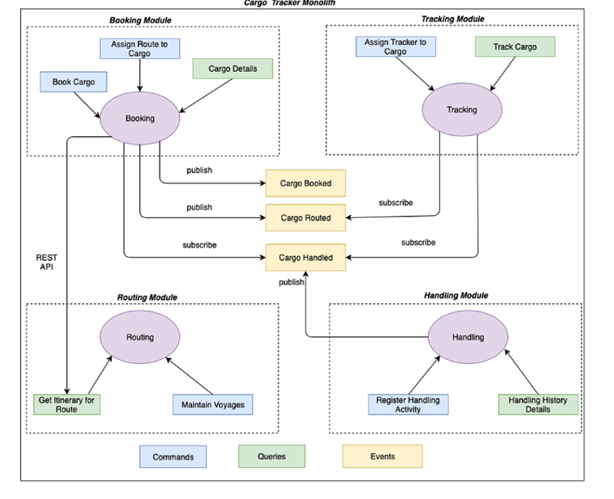

[](https://travis-ci.com/nodamu/CargoTracker)

## Cargo Tracker project
* Demo implementation of a cargo tracking application using Domain driven design principles

### Dependencies/Tools/Libs
* Spring Boot
* Spring Cloud - Ribbon, Eureka, Rabbitmq Binder, Hystrix, Feign
* Docker 
* H2 in-memory database

### Architecture


### How to run
* Run 
``` bash 
$ docker-compose up
```
* (-d if you don't want to see the logs)
